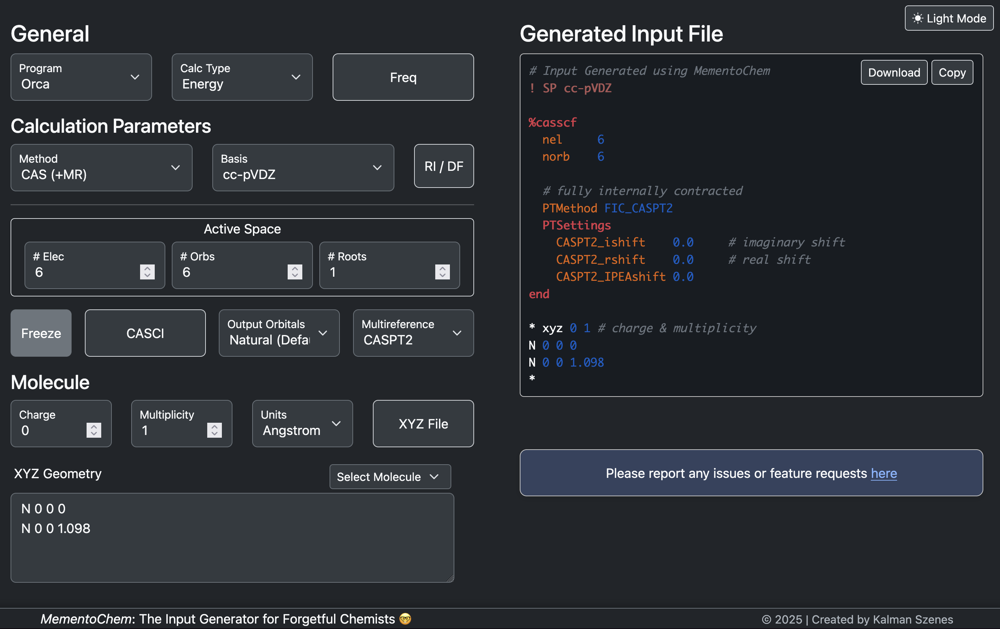

  <table>
    <tr>
      <td align="center">
        
      </td>
      <td align="center">
        
      </td>
    </tr>
  </table>

## Description

This repository hosts the source for the website www.mementochem.com, which provides an interface for conveniently and **quickly generating input files for common quantum chemistry programs**.
`MementoChem` is not meant to contain an exhaustive set of options but serves more as a template generator for common calculations.
These can subsequently be adapted by the user to their liking.

## Features

`MementoChem` can generate inputs for **single point**, **equilibrium structure** or **transition state optimization** and **harmonic frequency** calculations.

It supports most of the common electronic structure methods such as **single-** (e.g., MP2 and CC) and **multi-reference schemes** (e.g., CASSCF, CASPT2, NEVPT2, MRCC).

It also provides buttons to toggle common options for configuring calculations such as enabling **density-fitting**. 

In addition, SCF calculations come with **advanced configuration** options that allow the user to modify the solver (by using e.g., second-order solvers) or tighten the convergence thresholds --- keywords that I always seem to forget.

Finally, `MementoChem` supports common **workflows** such as **generating MP2/CASSCF natural orbitals** or **checking the stability of an unrestricted solution**.

Currently, it supports a subset of the features from the following programs (these are the programs that I am most familiar with)
- Orca
- PySCF
- OpenMolcas
- Psi4
- MRCC

If you encounter any issues or have a feature request, please let me know.

## Alternative Utilities

While I haven't extensively used it myself, the [ccinput](https://github.com/cyllab/ccinput) project seems to provide a neat CLI utility for generating input scripts for quantum chemistry programs.
However, it lacks support for multi-configurational calculations, which is my main focus.

## Acknowledgments

- List of basis sets have been taken from [Basis Set Exchange](https://github.com/MolSSI-BSE/basis_set_exchange)
- List of DFT functionals have been adapted from the [ORCA manual](https://www.faccts.de/docs/orca/6.0/manual/contents/detailed/model.html#choice-of-functional)
- Logo was adapted from ChatGPT with a benzene molecular orbital using VMD with the help of Evangelista's [vmd_cube](https://github.com/fevangelista/vmd_cube) script.
